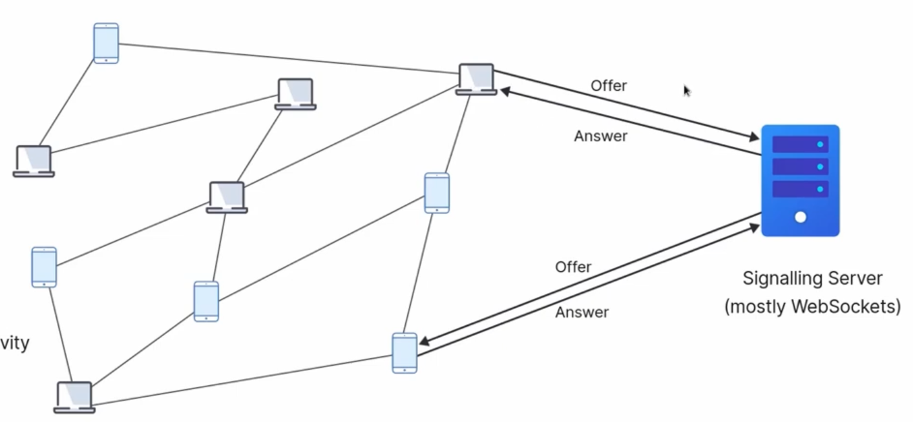
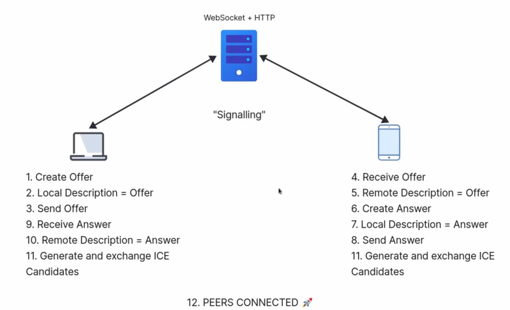

WebRTC works by exchaning Offers and Answers between 2 peers via Signalling Service.
Offer: The initiator creates an offer describing its capabilities (codecs, media types, etc.).
Answer: The recipient analyzes the offer and creates an answer, accepting or modifying the proposed terms.
The negoitation is called Signalling, sending and receiving offers and answers between peers.
After the offers are accepted between 2 are done, the path between the 2 is determined that is called ICE candidates, that is the routes of how both will communicate.
After Signalling, Peers exchange p2p connectivity information using something called ICE candidates
Offers, Answers are expressing using Session Description Protocol

Local Description of Peer 1 which initiates the connection goes to Peer 2 as a **Offer** and becomes Remote Description of Peer 2
Local Description of Peer 2 is sent to Peer 1 as **Answer** which becomes Remote Description of Peer 1.
Browser Handles generating and exchanging ICE candidates between peers.